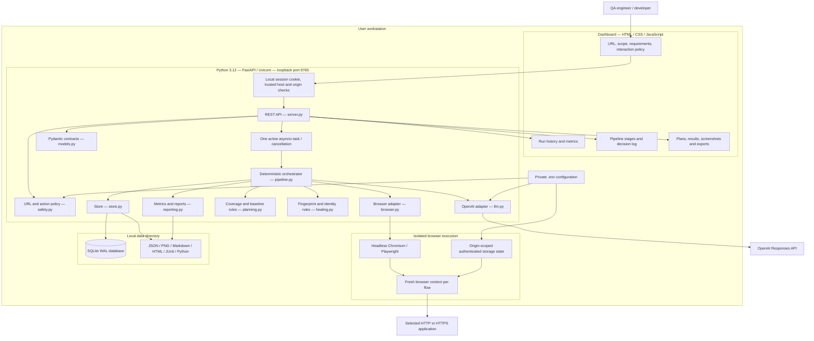
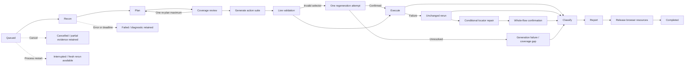
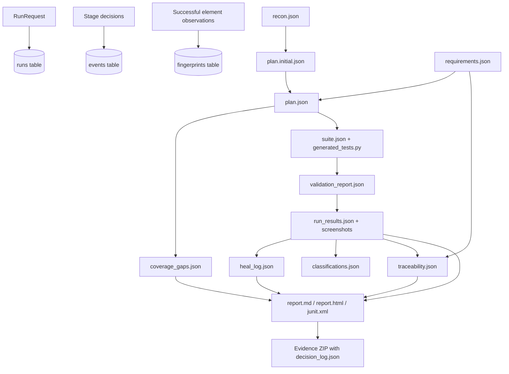
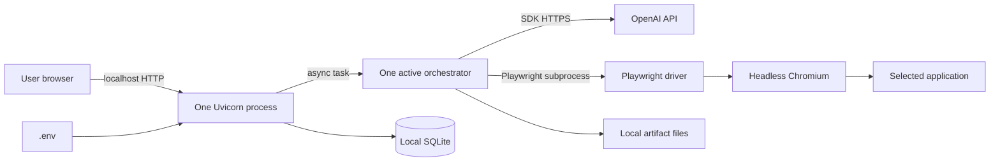

# Aviar — architecture and technology stack

This document describes the code currently implemented in this repository. Mermaid diagrams render in GitHub and Mermaid-capable Markdown previews.

## 1. System architecture



The dashboard polls the API every two seconds. The server owns the job lifecycle and browser processes. OpenAI proposes structured plans and, when needed, constrained repair candidates. Python code decides stage transitions and test outcomes.

## 2. Technologies actually used

Versions below are the direct pins in `requirements.txt`, not claims about the newest available releases.

| Layer | Technology | Purpose in this application |
|---|---|---|
| Runtime | Python 3.12 | Backend, orchestration, browser automation, reporting and tests |
| HTTP API | FastAPI 0.135.1 | Run submission, status, configuration, cancellation and downloads |
| ASGI server | Uvicorn 0.41.0 | Single worker listening on `127.0.0.1:8765` |
| Contracts | Pydantic 2.12.5 | Strict requests, action types, plans, flow IDs and repair proposals |
| AI provider | OpenAI API | Remote planning and constrained semantic repair proposals |
| AI SDK | openai 2.26.0 | `AsyncOpenAI.responses.parse`, typed output parsing and usage accounting |
| Configured model default | `gpt-5.4-mini` | Configurable with `OPENAI_MODEL`; the backend reads the active value at startup |
| Browser automation | Playwright 1.58.0 + Chromium | Auth, crawling, DOM observations, locator validation, execution and screenshots |
| Concurrency | Python `asyncio` | One active run, asynchronous browser/API I/O, deadlines and cancellation |
| Database | Python `sqlite3`, SQLite WAL | Runs, append-only application events, fingerprints and schema version |
| Artifact storage | Local filesystem / `pathlib` | Per-run files, temporary-file replacement and screenshot evidence |
| Configuration | python-dotenv 1.2.2 | Reads `.env` without putting secrets in frontend code |
| UI | HTML5, CSS3, vanilla JavaScript | Responsive dashboard, forms, tabs, metrics and run history |
| UI transport | Browser Fetch API + JSON polling | Two-second status updates and persistent history on reconnect |
| Unit/API testing | pytest 8.3.5 | Policy, contracts, classification, API, cancellation and persistence tests |
| HTTP verification | httpx 0.28.1 | Integration scripts and FastAPI test-client dependency |
| Reports / export | Python `json`, `html`, `xml.etree`, `zipfile` | JSON, escaped HTML, Markdown, JUnit XML and evidence ZIP |
| Local launch | PowerShell and Python | Windows setup, startup and project-scoped background restart |

There is no React, Node build step, LangGraph, CrewAI, Crawl4AI, browser-use, Redis, PostgreSQL or Docker in the current runtime. Some appear in the original proposal; this implementation uses the smaller stack above. Node was used for JavaScript syntax verification during development, but is not required to run the app.

## 3. End-to-end run sequence

```mermaid
sequenceDiagram
    actor QA as QA engineer
    participant UI as Dashboard
    participant API as FastAPI
    participant O as Python orchestrator
    participant B as Playwright / Chromium
    participant AI as OpenAI Responses API
    participant DB as SQLite + artifacts
    QA->>UI: Enter URL, scope and requirements
    UI->>API: POST /api/runs
    API->>API: Validate session, URL, request and admission limit
    API->>DB: Create queued run
    API-->>UI: 202 Accepted + run ID
    API->>O: Start asynchronous task
    O->>B: Establish origin-scoped auth if configured
    O->>B: Crawl observed same-origin links
    B-->>O: Bounded DOM/text/element observations
    O->>DB: recon.json + events
    alt OpenAI mode
        O->>AI: Observations, requirements and policy
        AI-->>O: Structured Plan + usage
    else Deterministic baseline
        O->>O: Generate observed-content assertions
    end
    O->>O: Check coverage and ground exact oracles
    opt Fixable gap and re-plan budget available
        O->>AI: Coverage feedback for one re-plan
        AI-->>O: Revised structured plan
    end
    O->>DB: Plan, gaps and executable action suite
    O->>B: Validate each flow in live page state
    opt Ambiguous locator with verified product anchor
        O->>O: Scope locator; preserve expectations
        O->>B: Validate regenerated flow
    end
    O->>B: Execute flows in fresh contexts
    opt Failed execution
        O->>B: One unchanged rerun
        opt Repeatable selector failure
            O->>O: Fingerprint matching and ambiguity gate
            opt Deterministic repair unavailable
                O->>AI: Request observed candidate selection
                AI-->>O: Candidate, confidence and rationale
                O->>O: Enforce semantic identity gate
            end
            O->>B: Confirm full flow with unchanged assertions
        end
    end
    O->>O: Classify evidence and aggregate metrics
    O->>DB: Results, screenshots, repairs and reports
    O->>B: Close contexts and browser
    O->>DB: Mark completed after resource cleanup
    loop Every 2 seconds
        UI->>API: GET /api/runs and selected run
        API->>DB: Read history and evidence
        API-->>UI: Current status, events and results
    end
    QA->>UI: Download evidence ZIP or replay suite
```

## 4. State transitions and bounded recovery



Cancellation and fatal errors can occur at any active stage. The diagram shows representative edges for readability. There is a ten-minute run deadline, five logical OpenAI-call maximum, one active run, and configured page/flow limits. Retries are bounded; unresolved scenarios become visible review items.

## 5. Data and artifact architecture



Run artifacts live in `data/<run-id>/`. `data/qa.sqlite3` stores history and indexes. Generated Python is a fixed replay entry point; the model supplies validated JSON actions, not arbitrary Python or shell code. Replay runs the same policy-controlled Playwright executor without calling OpenAI.

## 6. Origin configuration and process boundaries

Current configuration:

```dotenv
QA_ALLOWED_ORIGINS=*
```

This admits any valid HTTP(S) **target** origin, including local applications on other ports. To restore restricted admission:

```dotenv
QA_ALLOWED_ORIGINS=https://www.saucedemo.com,http://localhost:3000
```

The following are separate boundaries:

| Boundary | Behavior |
|---|---|
| Target admission | `*` accepts any HTTP(S) target; an explicit list restricts targets |
| Browser requests/navigation | Remain on the selected target origin for each run |
| Authentication | Credentials/storage state only apply to `TARGET_AUTH_ORIGIN` |
| Dashboard API | Loopback, trusted host, local HttpOnly cookie and origin checks; no wildcard CORS |
| Dashboard as a test target | Only its `/demo` paths are accepted |
| Generated actions | Fixed DSL, interaction opt-in, destructive/transaction click checks |
| OpenAI access | Backend-only API key; observations redacted for configured secrets |

Origin wildcard admission does not automatically support cross-origin SSO, separate API hosts or CDN dependencies. Such applications require a separate per-run resource-origin policy, which is not implemented here.

## 7. Local deployment topology



This is a local single-user topology. Shared deployment would require authentication/authorization, isolated workers, durable distributed admission, protected artifact storage, retention and operational controls described in the [implementation plan](Autonomous_Test_Orchestration_Agent_Architecture_and_Implementation_Plan.md).
