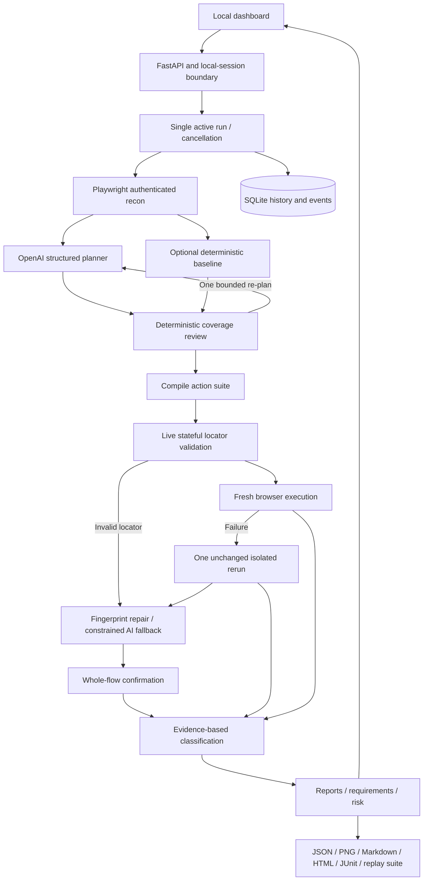

# Aviar: local QA architecture and implementation plan

Version 2.0 · 2026-09-05 · Implementation-aligned plan

Current configuration update: `QA_ALLOWED_ORIGINS=*` enables all HTTP(S) target origins. Explicit comma-separated allowlists remain supported. Per-run same-origin browser restrictions and origin-scoped authentication remain in effect. See [ARCHITECTURE.md](ARCHITECTURE.md) for detailed component, sequence, state, artifact and deployment diagrams and the complete technology stack.

Subsequent compatibility update: compatible resource loading now supports external HTTP(S) read resources, with a strict-origin option. Navigation admits canonical www/HTTPS redirects and explicitly added per-run origins. Startup performs real browser/write-access readiness checks and blocks admission on failure. These supersede earlier strict-only resource-loading descriptions below. See [FEATURES.md](FEATURES.md) for the current implemented-feature inventory.

## 1. Document analysis and decisions

The source research and downloaded architecture proposal identify the essential problem correctly: coordinating exploration, planning, coverage review, generation, execution, repair and evidence. A useful implementation must explain why a test exists, what was actually checked, and what remains unknown.

The source proposal is designed around a hackathon, GLM-specific assumptions and a proposed framework stack. Those embedded instructions are design material. The present user request establishes the actual target: OpenAI API, local execution, a usable dashboard, and an implementation that can be reviewed and operated reliably.

| Source proposal | Implementation decision | Reason / consequence |
|---|---|---|
| GLM-5.3 and vendor-specific reasoning settings | OpenAI Responses API, structured Pydantic outputs, configurable `OPENAI_MODEL` | Directly matches the requested provider; no GLM settings or pricing copied |
| LangGraph plus Crawl4AI plus browser-use | Explicit Python orchestration loop plus Playwright recon and execution | Smaller local installation; browser, policy and evidence use one execution substrate. No LangGraph checkpoint-resume or browser-use capability is claimed |
| Generated arbitrary Playwright source | Strict action DSL and generated Python replay entry point | Model data cannot become shell/Python execution; generated suites are executable through the shipped Playwright runner |
| Full React/WebSocket stack | Local HTML/CSS/JavaScript dashboard and bounded polling | No frontend toolchain/CDN needed; persistent event history makes reconnect straightforward |
| Healer adjusts fragile selectors | Fingerprint-first repair plus constrained OpenAI fallback | Assertions are immutable; every accepted repair requires full-flow confirmation |
| Confident real-defect verdict | Heuristic `likely_defect`, `flaky_test`, `needs_review` | A repeated wrong generated assertion is not proof of an application defect |
| Mid-flow crash resume / interactive interrupts | Interrupted state, preserved artifacts, explicit fresh rerun | Avoid replaying unknown side effects without idempotency guarantees |
| Estimated fixed per-run price | Actual returned token usage plus user-configured rates | Model pricing and workload vary; no fabricated estimate |
| “Works against any application” | Bounded same-origin DOM-based scenarios | CAPTCHA, 2FA, multi-origin authentication, canvas, native mobile, unsupported widgets and inaccessible states remain explicit gaps |

The original research's statistics and vendor claims are not necessary to run the software and have not been promoted into verified product claims.

## 2. Operating envelope

The delivered service is for one trusted user on one machine. The HTTP server binds to `127.0.0.1`, one worker owns browser jobs, and SQLite persists history. Browser tests run against explicitly allowed test origins. OpenAI calls are made only from the backend.

Local reliability controls are implemented, but production readiness is a validation outcome, not a label supplied by architecture. This release needs the acceptance evidence and environment-specific checks in section 11 before operational adoption. Internet-facing deployment requires the additional controls in section 12.

## 3. Architecture

Code ownership is modular even though deployment is one process:

| Module | Responsibility |
|---|---|
| `models.py` | Strict request, step, scenario, plan and repair contracts |
| `config.py`, `safety.py` | Environment configuration, URL/origin policy, action restrictions and secret redaction |
| `server.py` | Local API, session boundary, one-run admission, cancellation, evidence retrieval |
| `store.py` | SQLite versioned schema, transactions, event history, atomic artifact writes, fingerprints |
| `browser.py` | Auth, isolated contexts, bounded crawl, DOM observations, assertion execution, screenshots |
| `llm.py` | OpenAI Responses parsing, call budget, reported usage, timeout/refusal handling |
| `planning.py` | Deterministic baseline, line-based requirement IDs, coverage heuristics |
| `pipeline.py` | Stage sequencing, bounded re-plan/repair/rerun, artifact chain |
| `healing.py` | Similarity, ambiguity rejection, semantic identity and evidence classification |
| `reporting.py` | Counts, requirements matrix, report formats and JUnit XML |
| `replay.py` | Execute exported scenarios without OpenAI |
| `ui/` | Dashboard, run form, history, plans, evidence, risks and configuration |
| `demo/` | Local store with controllable cart, search and discount flows |

## 4. Data contracts and invariants

`RunRequest` contains URL, optional natural-language scope and requirements, planner mode, page/flow budgets, and an explicit interaction flag. No API key or password is accepted through this API.

Each requirement line receives a stable ID within the run: `REQ-1`, `REQ-2`, etc. This is line-based ingestion, not PDF parsing or semantic requirements extraction. The exact lines are retained in `requirements.json`.

Each flow contains an ID, name, risk, category, requirement links, oracle provenance, and ordered actions. Allowed actions are `navigate`, `fill`, `click`, `assert_visible`, `assert_text`, and `assert_url`. Steps have `target`, `value`, and human-readable intent.

Invariants enforced in code:

- Every flow begins with navigation and contains at least one assertion.
- Flow IDs are unique and safe for artifact filenames.
- Requirement links reference supplied IDs. Requirement-backed oracles must have links, and every assertion value must be an exact quoted literal in the linked requirements. Other model-proposed oracles are downgraded to inferred, preserving their requirement links.
- Navigation stays within the allowed target origin.
- Every used element must resolve uniquely and be visible before interacting or asserting.
- Text/URL expectations must be nonempty.
- Healing changes one locator only. It cannot change assertion value, remove steps, or change expected behavior.
- A repair is verified only when the complete scenario passes again.
- Failed and blocked scenarios remain distinct from passed scenarios.
- Pass rate is a scenario metric, not a claimed percentage of application coverage.

## 5. Pipeline details

### Input and authentication

Validate URL and resource budgets before queuing. Reject OpenAI mode immediately if the key is absent. Redact configured secrets if accidentally pasted into scope or requirements. Enforce one active run to prevent resource contention.

For a matching `TARGET_AUTH_ORIGIN`, load a private storage-state file or log in using selectors and credentials from local environment configuration. Verify the configured success element before proceeding. Auth failure ends the run with an actionable error; the system never silently tests the login page as though it were the application.

Authenticated state stays in memory unless the user independently supplied a storage file. Each flow receives a fresh browser context initialized from that state. Server-side data is not automatically reset between contexts.

### Recon

Breadth-first navigation follows observed same-origin links up to the requested page budget. Capture page URL, title, bounded visible text, visible element fingerprints, link inventory and HTTP status. Do not capture input values or hidden fields. Page observations are untrusted data in subsequent model prompts.

The crawler does not click through every menu or form. Consequently, state-dependent pages without links may be unknown to the planner. Pages with CAPTCHA/2FA indicators are called out rather than bypassed.

### Planning and coverage review

AI mode supplies the recon digest, scope, requirements and policy to the OpenAI Responses API. Structured Outputs constrain response shape; Pydantic and deterministic checks further constrain accepted behavior. Refusal or incomplete output fails clearly.

Coverage review runs before generation. It checks requirement links, missing negative/boundary coverage when input controls exist, and smoke-only plans. Fixable gaps trigger at most one re-plan. Remaining gaps are preserved. This heuristic is not a semantic proof of PRD coverage.

Baseline mode generates content assertions directly from observed headings or prominent elements. It makes no LLM calls and clearly reports its limited coverage.

### Generation and live validation

Serialize `suite.json` and a Python entry point. The shipped executor interprets validated action data into real Playwright operations. No model-generated program is evaluated.

Validation replays each flow, checking each locator at the point of use. This handles state-dependent selectors more honestly than checking every selector on the home page. Assertion failures are retained for execution/triage, rather than being repaired by weakening expectations. Invalid locators receive one bounded fingerprint-based regeneration attempt; unresolved selectors become `generation_failed`.

For a repeated locator during validation, a deterministic regeneration rule may use the immediately preceding successfully asserted text element as an anchor. It chooses a unique match inside that anchor's smallest containing ancestor, excluding the document body. Selection never uses the expected price/text of the failing assertion. The resulting locator must still pass validation and a fresh execution with unchanged expectations. The audit records this as `scoped_regeneration`; it is distinct from runtime fingerprint healing. Reported verified repairs include both confirmed regeneration and runtime repair, with runtime repairs also counted separately.

### Execution, triage and repair

Run each scenario in a fresh context. Retain step outcomes, elapsed time, screenshots, page errors and HTTP error observations. Text assertions use visible inner text, excluding hidden descendants. HTTP failures remain separate warnings rather than replacing the declared UI oracle: SauceDemo can return an HTTP 404 on a deep link while rendering its SPA content. On failure, rerun the unchanged flow once. An unchanged pass is a flakiness signal; the initial failure remains visible and does not become a clean pass.

For repeatable locator failures, retrieve a last-successful fingerprint or an observed recon fingerprint. Compare tag, type and semantic attributes; reject ambiguity. Tier 1 requires similarity at least 0.85 and a lead of at least 0.10 over the next candidate. Tier 2 may ask OpenAI to select an observed candidate, but requires model confidence at least 0.90 plus a deterministic unique semantic identity check. Model confidence alone cannot authorize a repair.

Run the complete repaired flow with unchanged assertions. Record the selector delta, tier, rationale, confidence and confirmation outcome. Store fingerprints from successful executions only. A first-ever selector with no known fingerprint is not guessed into success.

### Classification and reporting

| Label | Evidence |
|---|---|
| `passed` | All assertions passed in the recorded execution |
| `blocked` | Run policy prevented execution; coverage remains missing |
| `flaky_test` | Initial failure followed by unchanged passing rerun; root cause not established |
| `healed_ok` | Locator-only runtime repair followed by whole-flow success |
| `likely_defect` | Same requirement-backed assertion failed at the same step in two isolated attempts |
| `needs_review` | Ambiguous selector, inferred/observed expectation failure, execution error or insufficient evidence |

Confidence numbers are conservative heuristic scores, not calibrated probabilities. Even requirement-backed classification needs a reviewer to confirm that the generated assertion faithfully expresses the requirement.

Reports include scenario statuses, risk, oracle provenance, evidence, repair history, remaining gaps, requirement links and passing linked scenarios, duration, OpenAI calls and returned token usage. Export includes HTML, Markdown and JUnit. HTML content is escaped and downloaded as an attachment.

## 6. Persistence and operational behavior

`data/qa.sqlite3` uses WAL and transactional writes. Tables are runs, events, fingerprints and schema version. Every stage appends a decision event. JSON and text artifacts use temporary-file replacement to avoid half-written files being served.

On startup, queued/running records become `interrupted`. Automatic continuation from a clicked/filled browser state is not attempted. The user may launch a fresh run with the same inputs. Partial evidence remains inspectable.

Cancellation propagates through awaited browser/API operations and closes contexts/browser resources. The pipeline has a ten-minute wall-clock deadline. Shutdown cancels active tasks and retains partial records.

Retention is manual in this release. Backups require the service to be stopped and the entire data directory copied together. This avoids inconsistent database/artifact snapshots. Full disk, corrupted database and backup restoration are operational release tests, not yet established by unit tests.

## 7. Resource and safety controls

| Control | Current limit / behavior |
|---|---|
| Active runs | 1 |
| Pages / scenarios | Up to 12 each; UI defaults 5 pages / 6 flows |
| Actions per flow | Up to 20 |
| Model calls | Up to 5 logical calls; SDK may retry each once |
| Model timeout | 60 seconds per request |
| Output limit | 6,500 tokens per response |
| Total run deadline | 600 seconds |
| Context | 100 visible elements / 7,000 visible-text characters per observed page |
| Request body | 24 KB at application middleware |
| Browser navigation | Same origin; default 20-second timeout |
| Locator/action wait | 5 seconds |
| Credential storage | Local `.env` or private storage-state file; excluded from Git |
| Frontend boundary | HttpOnly SameSite local cookie, host validation, origin checks, CSP, no CORS |

These are bounded local controls, not a hardened security sandbox. The selected origin can have state-changing GET routes, broad application permissions, or sensitive visible data. Real test accounts and resettable data remain necessary. Browser-level route restrictions are not a substitute for OS/network egress isolation in remote deployment. Cross-origin application assets and API dependencies are intentionally blocked and may prevent complex sites from working.

Screenshots mask inputs and textareas, and configured secrets are redacted from textual observations/errors. Other visible sensitive information can still appear in artifacts. Do not treat redaction as a general PII classifier. Avoid production customer data and protect the data directory, especially in synced workspaces.

## 8. Detailed implementation sequence and acceptance criteria

| Work package | Delivered implementation | Acceptance evidence |
|---|---|---|
| 1. Contracts/configuration | Validated actions, requests, plan IDs, model configuration | Invalid action/URL/flow tests |
| 2. Persistence/API | Run records, events, admission, cancellation, local session | API/auth/recovery tests |
| 3. Browser substrate | Auth, same-origin crawl, snapshots, isolated execution | Real local and SauceDemo browser runs |
| 4. Planner/meta-review | OpenAI parsing, requirement IDs, bounded re-plan, baseline | Mocked API contract tests plus live model run when credentials permit |
| 5. Generator/validator | DSL suite, stateful locator checks, replay command | Exported suite executes without LLM |
| 6. Triage/healer | Unchanged retry, identity/ambiguity checks, confirmed repair | Seeded selector drift with real browser replay |
| 7. Reports/dashboard | Dynamic history, stages, plan, evidence, gaps, exports | Browser-driven run creation, tabs, responsive screenshots |
| 8. Local hardening | Limits, cancellation, startup recovery, documentation | Full tests, operating instructions and known-limit review |

No individual test establishes universal autonomy or semantic correctness. Keep the verification record with each release.

## 9. Test strategy

Unit/API checks cover policy boundaries, credential redaction, unsupported action rejection, ambiguous healing, heuristic classification, requirement traceability, escaped reporting, SQLite recovery, local session enforcement, invalid requests, and the OpenAI parsing/refusal contract.

The integration verifier creates a run through the actual dashboard, waits for persisted completion, checks report artifacts, captures desktop/mobile views, checks JavaScript errors and page overflow, performs real cart and negative coupon actions, injects a wrong expected price to exercise repeated assertion classification, and confirms a seeded locator repair against the real browser.

SauceDemo baseline verifies the supplied authentication profile and real page-content assertions. Live OpenAI testing is a separate gate: it must show a parsed real model response, actual token usage, generated flows, live browser outcomes and remaining gaps. Mocked API tests and baseline runs cannot substitute for this gate.

## 10. Current limitations

- Single-user loopback service; no SSO, RBAC, remote API tokens, team tenancy or distributed queue.
- Sequential flow execution and simple link crawl; no full interaction-driven discovery, cross-browser matrix, accessibility audit or visual regression engine.
- No interactive CAPTCHA/2FA handling, automatic mid-run resume, semantic PRD parser or file upload.
- One configured authentication profile at a time; no full persona matrix.
- Simple CSS fingerprint hierarchy, not the full ten-tier locator strategy proposed in the source document.
- Strict same-origin resources may block apps with CDN, API or SSO origins.
- Heuristic coverage/classification and conservative healing. No claim of calibrated defect confidence or complete requirement coverage.
- Generated Python entry point depends on the installed project runner. JSON suite remains portable data; standalone Playwright Test TypeScript is not generated.
- No automatic data retention, encrypted storage, browser traces, real-time WebSocket transport, CI provider integration, or automatic test-data reset.

## 11. Local release gates

Before relying on a real application’s results:

1. Run unit/API tests and real browser integration checks on the deployment machine.
2. Run the AI pipeline with an approved key/model and review at least one generated plan against supplied requirements.
3. Verify positive, negative, selector-drift and repeatable assertion-failure cases against controlled target data.
4. Confirm target allowlist, auth profile and interaction policy with the test-environment owner.
5. Exercise cancellation and interrupted startup recovery; confirm browser processes exit.
6. Replay an exported suite and restore a backup in a separate directory.
7. Review actual screenshots/observations for sensitive data before sharing evidence.
8. Establish retention, disk budget and per-project OpenAI spending limits externally.

## 12. Additional production deployment work

If this becomes a shared or remotely hosted service, implement these before exposure:

- OIDC/SSO, role-based access, per-user project isolation, CSRF tokens and authenticated artifact authorization.
- Container/VM browser workers with network egress controls, DNS/IP enforcement, target ownership policy, resource limits and secret injection.
- Durable queue and worker leases, idempotency keys, transactional run claiming, schema migrations, crash-safe stage checkpoints and deliberate resume semantics.
- PostgreSQL and object storage when multiple workers are required; encryption, retention jobs and backup/restore drills.
- Structured metrics, health/readiness, distributed tracing with redaction, alerting, job timeouts and incident/runbooks.
- Dependency lock with hashes/SBOM, vulnerability scanning, reproducible builds and a tested update process.
- Target-specific reset fixtures, multi-origin policies, persona sessions, calibration datasets for classification, and evals preventing assertion weakening.

The existing module boundaries support those extensions, but they are not represented as completed features.

## 13. Primary technical references

- [OpenAI Structured Outputs](https://developers.openai.com/api/docs/guides/structured-outputs): typed response parsing and refusal handling.
- [Playwright BrowserContext](https://playwright.dev/python/docs/api/class-browsercontext): isolated contexts, storage state and route controls.
- Source inputs: repository research report and the user's downloaded version-1 architecture proposal. Original vendor assumptions are superseded by this implementation-aligned plan.
