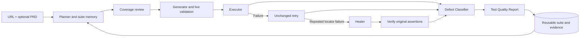

# AIVAR — Autonomous Test Orchestration Agent

**Give AIVAR a website URL. Get a reusable test suite, verified locator repairs, and a Test Quality Report with browser evidence.**

Built for the Bessemer Tech Catalyst AI/ML problem statement. AIVAR coordinates **Planner → Generator → Executor → Healer → Defect Classifier**, evaluates coverage between stages, and records why it reused, extended, retried, repaired or escalated a test.

The focus is maintaining useful tests as a website changes. Repeat runs retain scenario IDs and expected results. Locator drift can be repaired after verification; changed expected behavior remains visible as a failure requiring investigation.

## For the jury: start here

| Read | What it answers |
|---|---|
| [Jury and demo guide](docs/JURY_GUIDE.md) | What to demonstrate in five minutes and how to interpret the results |
| [Architecture](docs/ARCHITECTURE.md) | Components, orchestration, browser isolation and data flow |
| [Technology decisions](docs/TECHNOLOGY_DECISIONS.md) | Why V1 stays minimal and how optional V2 uses LangGraph |
| [Implemented features](docs/FEATURES.md) | What each feature actually does |
| [PDF alignment and self-healing](docs/SELF_HEALING_AND_PDF_ALIGNMENT.md) | Requirement mapping, reuse rules, repair gates and limitations |
| [Verification](docs/VERIFICATION.md) | Measured results, reproducible checks and unresolved observations |
| [Report guide](docs/REPORT_GUIDE.md) | How to read the ZIP, classifications and repair evidence |
| [Implementation roadmap](docs/IMPLEMENTATION_PLAN.md) | Delivered milestones and future engineering work |

## V2 agent orchestration

The existing pipeline remains the default. Set `QA_PIPELINE_VERSION=v2` to use the
LangGraph workflow with explicit PRD Analyst, Planner, Evaluator, Generator, Healer,
and Reporter agents. The Executor and routing policies remain deterministic. V2 uses
the same API, UI, browser safety controls, artifacts, SQLite run store and suite
evolution behavior as V1; its graph checkpoints are stored separately in
`data/langgraph-v2.sqlite3`.

The [V2 repair record](QPILOT_V2_REPAIR_PLAN.md) maps the 23 audited issues to repairs
and verification. V2 publishes stage starts and per-test results, preserves agent
fallback diagnostics, and excludes rejected tests from execution. Dropdowns use
`select_option`; native invalid-input checks use `assert_invalid`. Passing smoke
tests do not establish coverage of all PRD acceptance criteria.

V2 reserves calls for final evaluation and reporting within `QA_V2_MAX_LLM_CALLS`
(default 8). The Configuration panel displays the actual budget. SDK retries may
make more HTTP attempts than this logical-call count.

After an interruption, **Resume run** appears only if a compatible checkpoint is
at a safe non-browser boundary and its original ten-minute deadline is still valid.
Resume preserves consumed calls and tokens. Unknown in-flight browser actions cannot
be resumed; use **Run again** after restoring known test preconditions. The API is
`POST /api/runs/{id}/resume`; restarting the server does not automatically replay jobs.

Verification commands (the live checks use the configured API key):

```powershell
.\.venv\Scripts\python.exe -m pytest -q -p no:cacheprovider
.\.venv\Scripts\python.exe scripts/verify_v2_llm.py
.\.venv\Scripts\python.exe scripts/verify_v2_local_ai.py
```

The last command uses a temporary local page with known fixture requirements. An
external-site rerun using `scripts/verify_v2_run.py` requires permission to test that target.

## Run locally

Prerequisites: **Python 3.12** and Chromium installed through Playwright. OpenAI mode needs your own API key and network access. Baseline needs no model key. Windows is the verified environment; Linux/macOS instructions are supplied but were not acceptance-tested here.

From the repository root in PowerShell:

```powershell
python -m venv .venv
./.venv/Scripts/python.exe -m pip install -r requirements.txt
./.venv/Scripts/python.exe -m playwright install chromium
if (!(Test-Path .env)) { Copy-Item .env.example .env }
```

Set `OPENAI_API_KEY` privately in `.env`. `OPENAI_MODEL` is configurable; the example uses `gpt-5.4-mini`. Model access depends on your account. Keep `.env` private.

```powershell
./.venv/Scripts/python.exe run.py
```

Open **[http://127.0.0.1:8765](http://127.0.0.1:8765)** and check runtime readiness under **Configuration**. On subsequent launches, `./start.ps1` starts the application. Stop with **Ctrl+C** before starting another instance. Do not use multiple workers or Uvicorn `--reload` with this Windows browser process.

On Linux/macOS, create the environment with `python3 -m venv .venv` and use `.venv/bin/python` instead. Linux may require `.venv/bin/python -m playwright install --with-deps chromium`.

## First run

1. Click **Try a demo**, then start the baseline. It executes real Chromium checks against the included Fieldnotes shop without AI calls.
2. For business-flow planning, choose **New test run → OpenAI · Business-flow planning** and enter a test URL.
3. Optionally upload [the example Markdown PRD](examples/fieldnotes-prd.md) and enter a focus area. Enable **Allow clicks and form input** for the example cart, search and coupon scenarios.
4. Under **Execution options**, select the **Page budget** (pages explored) and **Scenario budget** (cases planned). Both support 1–12; defaults are five pages and six cases.
5. Inspect **Results**, **Planner**, **Decision log**, **PRD coverage & risks**, **Defect Classifier**, and **Changes & repairs**.
6. Choose **Export evidence**, unzip it, read **START_HERE.md**, and open **report.html**. The [report guide](docs/REPORT_GUIDE.md) explains the artifacts.
7. **Run again** preserves the URL, policy, focus and PRD. Matching scenarios are reused; new evidence or PRD gaps can trigger additions within the budget.

**Baseline checks observed content. OpenAI plans business flows.** A completed run means orchestration finished, not that every test passed. A 100% scenario pass rate does not mean full application coverage.

## What makes it agentic?



The Python meta-orchestrator chooses transitions from browser evidence and coverage gaps. A repair changes only a uniquely identified failed locator, then replays the complete flow. Ambiguous repairs and changed business expectations are escalated. V1 uses the original direct orchestrator; optional V2 uses a checkpointed LangGraph while retaining the same safety rules.

## Verified behavior

- **36 unit/API/lifecycle tests passed** on Windows.
- A controlled browser sequence verified locator repair, reuse of that repair, preservation of a content regression, and a new scenario for a newly discovered page.
- PRD upload, classifier/change tabs, mobile width and JavaScript-error checks passed.
- The final end-to-end run passed the dashboard-created baseline (2/2), generated-suite replay, local interactions, repair/classifier fixtures, authenticated SauceDemo baseline (1/1), and cancellation.
- Two live OpenAI PRD runs demonstrated **two scenarios retained and one added**. The first passed **1/2** cases; the second passed **2/3**. An unsupported placeholder-text assertion remained unresolved in both. This is a documented limitation, not an application defect claim.

See [Verification](docs/VERIFICATION.md) for exact scope and records. Generated plans can vary across runs and model versions.

## Test and replay

```powershell
./.venv/Scripts/python.exe -m pytest -q
# Start run.py before browser acceptance checks:
./.venv/Scripts/python.exe -m scripts.verify_evolution
# Optional live OpenAI check; incurs API usage:
./.venv/Scripts/python.exe -m scripts.verify_prd_ai
# Replay an exported suite from this repository without planning calls:
./.venv/Scripts/python.exe -m qa_agent.replay "path/to/extracted/suite.json"
```

Other targeted checks cover local interactions, network compatibility and authenticated SauceDemo; see [Verification](docs/VERIFICATION.md). Replay needs this project's interpreter, dependencies, browser and local authentication. The ZIP is not a standalone browser installer.

## Target access and operating limits

`QA_ALLOWED_ORIGINS=*` admits HTTP(S) targets. Authentication, CAPTCHA/MFA, cross-domain journeys, dynamic state, canvas and inaccessible content can still limit testing. Compatible loading supports external read resources; navigation remains constrained. Additional navigation origins remain an API compatibility option, not a dashboard field.

For SauceDemo, use `https://www.saucedemo.com/inventory.html`, set credentials privately in `.env`, and retain `TARGET_AUTH_ORIGIN=https://www.saucedemo.com`. The example selectors match that login. Other sites need their own login selectors or `QA_STORAGE_STATE`. No credentials are committed.

Limits: **one local user, one active run, Chromium, ten minutes, five logical model calls**. Each SDK call can retry once. A failed scenario gets one unchanged execution retry and at most one locator repair with confirmation. Interactions can repeat during validation and retry; use resettable test data. Payments, destructive actions and order completion are blocked by the current policy.

This is a working local hackathon implementation. Multi-user hosting, distributed execution, CI/CD integration, arbitrary flow repair and complete production coverage are not delivered features.

## Troubleshooting and data

| Symptom | Action |
|---|---|
| Browser missing | Run the Playwright Chromium installation command. |
| `[WinError 5] Access is denied` | Start in a normal local PowerShell terminal; check folder/browser permissions. Inspect Configuration and `runtime_error.json`. The application cannot bypass OS policy. |
| Port already in use | Stop the existing server. `scripts/restart_local.ps1` is a helper for an idle local server. |
| OpenAI key/model error | Check private `.env`, account access and connectivity, then restart. Baseline needs no key. |
| Protected page unavailable | Configure target-specific authentication; review crawl gaps. |
| Settings not reflected | Restart and refresh the dashboard. |

`data/` stores SQLite history, PRDs, screenshots and reports. It is gitignored, not encrypted. Stop the server before backing up the entire directory. Retention is manual. Optional token prices in `.env` enable estimates; unset prices remain unavailable. Timed-out calls can still incur provider charges.

## Repository map

```text
qa_agent/      API, planner, browser, Healer, persistence and reports
ui/            Dashboard HTML/CSS/JavaScript; no frontend build step
demo/          Fieldnotes test application
scripts/       Startup, readiness and acceptance checks
tests/         Unit, API, lifecycle and repair-invariant tests
examples/      Optional Markdown PRD
docs/          Jury guide, architecture, decisions, evidence and roadmap
docs/archive/  Original research, separated from implementation claims
data/          Local generated evidence and state; ignored by Git
```

The [original research](docs/archive/ORIGINAL_RESEARCH.md) is retained as provenance. Its proposed stack and numerical claims are not the specification of the running implementation.
