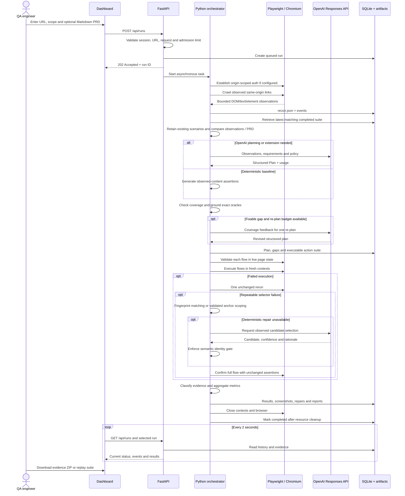
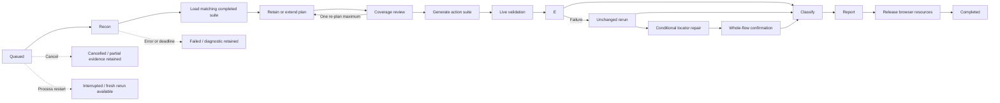
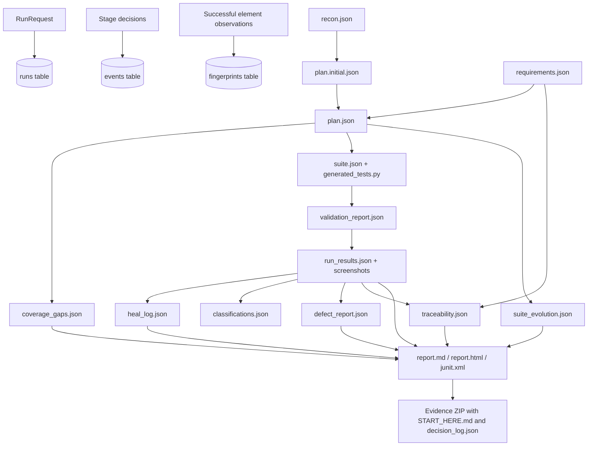
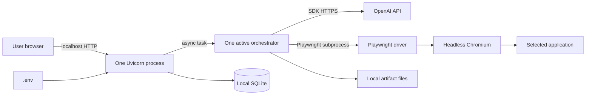

# AIVAR — architecture and technology stack

Current enhancement: [Self-healing, persistent suites, PRD uploads and PDF alignment](SELF_HEALING_AND_PDF_ALIGNMENT.md) documents the implemented agent decisions, limits, report fields and verification.
This document describes the code currently implemented in this repository. Mermaid diagrams render in GitHub and Mermaid-capable Markdown previews.

The reasons for choosing this stack and the conditions that would justify LangGraph, PostgreSQL, React or broader browser-agent tooling are documented in [Technology decisions](TECHNOLOGY_DECISIONS.md).

Runtime hardening update: startup now runs filesystem and real browser readiness probes (`runtime.py`); failed readiness blocks job admission. Compatible resource loading permits external assets/read requests, while navigation is constrained to the site, canonical redirects and per-run additional origins. The [feature guide](FEATURES.md) documents these controls and diagnostics in detail.

## 1. System architecture

The pipeline runs **nine sequential agent stages**. Python code controls every transition; OpenAI is called only for planning and constrained locator repair (≤ 5 calls/run).

```mermaid
flowchart TB
    User(["👤 QA Engineer / Developer\n(URL · PRD · Scope · Interaction policy)"])

    subgraph Dashboard["🖥️ Dashboard  —  HTML / CSS / Vanilla JS  (ui/)"]
        UI_Submit["Submit run\nPOST /api/runs"]
        UI_Poll["Poll every 2 s\nGET /api/runs/:id"]
        UI_Results["Results · Planner · Decision log\nPRD coverage · Defect Classifier\nChanges & repairs · Artifacts · Export ZIP"]
    end

    subgraph Backend["🐍 Python Backend  —  FastAPI + Uvicorn  ·  port 8765  (qa_agent/)"]

        subgraph Gate["Entry Gate  (server.py · safety.py · models.py)"]
            API["REST API\nserver.py"]
            Admit["Admission guard\n— one active run —"]
            Policy["Policy gate\nURL allow-list · action DSL\ndestructive/payment block"]
            Contracts["Pydantic contracts\nRunRequest · Plan · Flow · Step\nHealProposal"]
        end

        subgraph Orchestrator["Meta-Orchestrator  (pipeline.py · triage.py)"]
            direction TB

            ExploreAgent["1️⃣  Explorer Agent\nbrowser.py · crawl()\n─────────────────\nTools: Playwright page.goto\n  DOM SNAPSHOT JS (elements · text · links)\n  network route logger\n  auth_state() — storage_state\nOutputs: recon.json"]

            PlannerAgent["2️⃣  Planner Agent\nplanning.py · evolution.py · llm.py\n─────────────────\nTools: previous_suite() — SQLite history\n  remap_requirements() — PRD delta\n  merge_plan() — dedup by signature\n  llm.plan() → OpenAI Responses API\n  baseline_plan() — deterministic fallback\nOutputs: requirements.json · plan.initial.json\n         suite_evolution.json"]

            CoverageAgent["3️⃣  Coverage Checker\nplanning.py · coverage()\n─────────────────\nTools: requirement-link audit\n  ground_oracles() — quoted-literal check\n  gap detector (negative/boundary/business)\nOutputs: coverage_gaps.json · plan.json\n  ➜ triggers one bounded re-plan if fixable gaps"]

            GenAgent["4️⃣  Generator\npipeline.py · export_suite()\n─────────────────\nTools: Pydantic Plan→JSON serialiser\n  suite.json + generated_tests.py writer\nAction DSL: navigate · fill · click\n  assert_text · assert_url · assert_visible\nOutputs: suite.json · generated_tests.py"]

            ValidateAgent["5️⃣  Validator\nbrowser.py · execute_flow(attempt=validation)\n─────────────────\nTools: Playwright locator.expect × 1 per flow\n  scope_ambiguous_selector() — nth-of-type scoping\n  DOM fingerprint capture\nOutputs: validation_report.json\n  scoped_regeneration hint on selector miss"]

            ExecuteAgent["6️⃣  Executor\nbrowser.py · execute_flow(attempt=run)\n─────────────────\nTools: Playwright fresh context per flow\n  page_error · HTTP-error diagnostics listener\n  screenshot capture (masked inputs)\n  PolicyError → blocked classification\nOutputs: run_results.json · *.png screenshots"]

            TriageAgent["7️⃣  Triage / Retry Node\ntriage.py · triage_flow()\n─────────────────\nTools: execute_flow(attempt=retry) — 1 unchanged replay\n  failure_kind detector (selector · assertion · execution)\n  agent_decisions transition log\nOutputs: retry result · transitions log"]

            HealerAgent["8️⃣  Healer Agent\nhealing.py · pipeline.py · repair()\n─────────────────\nTools: store.fingerprint() — SHA-256 element key\n  deterministic_candidate() — similarity ≥ 0.85\n  semantic_match() — tag + text/name/testid guard\n  llm.heal() → OpenAI (only if deterministic fails)\n  execute_flow(attempt=healed) — full-flow confirmation\n  identity gate: repairs limited to the failed locator only\nOutputs: heal_log.json · updated suite.json"]

            ClassifyAgent["9️⃣  Defect Classifier\nhealing.py · classify() + triage.py · defect_report()\n─────────────────\nTools: outcome labels:\n  passed · healed_ok · flaky_test\n  likely_defect · needs_review\n  environment_issue · blocked\n  issue_type + next_action fields\nOutputs: classifications.json · defect_report.json"]

            Reporter["📋  Quality Reporter\nreporting.py · reports()\n─────────────────\nTools: suite_evolution.json merger\n  traceability.json (PRD→scenario→result)\n  HTML / Markdown / JUnit XML renderer\n  evidence ZIP builder (START_HERE.md)\nOutputs: report.md · report.html · junit.xml\n         decision_log.json · export.zip"]
        end

        LLMAdapter["🤖  LLM Adapter  (llm.py)\nAsyncOpenAI.responses.parse\nmodel: gpt-5.4-mini (configurable)\nmax 5 calls/run · 1 retry · 6500 output tokens\nllm.plan()  —  business-flow test plan\nllm.heal()  —  constrained locator repair"]

        Store["🗄️  Store  (store.py)\nSQLite WAL: runs · events · fingerprints\nArtifact filesystem: data/<run-id>/\nread() · artifact() · fingerprint()"]

        Runtime["⚙️  Runtime  (runtime.py · config.py)\nlaunch_browser() — readiness probe\nerror_details() — diagnostic capture\npython-dotenv .env loader"]
    end

    subgraph BrowserExec["🌐 Isolated Browser Execution  (Playwright subprocess)"]
        Chromium["Headless Chromium\n1440×1000 viewport\nservice_workers: block\naccept_downloads: false"]
        Contexts["Fresh context per flow\n5 s element timeout · 20 s nav timeout\nnetwork route logger\norigin-scoped auth storage state"]
    end

    subgraph ExtStorage["💾 Local Storage  (data/)"]
        SQLite[("SQLite WAL\nqa.sqlite3\nruns · events · fingerprints")]
        Artifacts["Per-run artifacts\nrecon.json · plan.json · suite.json\nrun_results.json · heal_log.json\nclassifications.json · defect_report.json\nreport.html · junit.xml · *.png · export.zip"]
    end

    OpenAI(["☁️  OpenAI Responses API\ngpt-5.4-mini (default)\nStructured output — Plan / HealProposal"])
    TargetApp(["🌍  Target Application\nHTTP/S — any origin admitted by QA_ALLOWED_ORIGINS"])
    Env["🔑  .env\nOPENAI_API_KEY · OPENAI_MODEL\nQA_ALLOWED_ORIGINS\nTARGET_AUTH_ORIGIN · credentials"]

    %% User → Dashboard → API
    User -->|"URL · PRD · scope\ninteraction policy"| UI_Submit
    UI_Submit -->|"POST /api/runs"| API
    API --> Admit --> Policy --> Contracts
    Contracts --> ExploreAgent

    %% Pipeline flow
    ExploreAgent -->|"recon.json"| PlannerAgent
    PlannerAgent -->|"plan.initial.json"| CoverageAgent
    CoverageAgent -->|"plan.json + gaps"| GenAgent
    GenAgent -->|"suite.json"| ValidateAgent
    ValidateAgent -->|"validation_report.json"| ExecuteAgent
    ExecuteAgent -->|"run result"| TriageAgent
    TriageAgent -->|"repeated selector failure"| HealerAgent
    HealerAgent -->|"healed result"| ClassifyAgent
    TriageAgent -->|"passed / escalate"| ClassifyAgent
    ClassifyAgent -->|"labels + defect records"| Reporter

    %% Re-plan feedback loop
    CoverageAgent -->|"fixable gaps → 1 re-plan"| LLMAdapter
    PlannerAgent -->|"llm.plan()"| LLMAdapter
    HealerAgent -->|"llm.heal() if deterministic fails"| LLMAdapter
    LLMAdapter -->|"structured Plan / HealProposal"| OpenAI
    OpenAI -->|"parsed response"| LLMAdapter

    %% Browser tools
    ExploreAgent -->|"crawl()"| Chromium
    ValidateAgent -->|"execute_flow(validation)"| Chromium
    ExecuteAgent -->|"execute_flow(run)"| Chromium
    TriageAgent -->|"execute_flow(retry)"| Chromium
    HealerAgent -->|"execute_flow(healed)"| Chromium
    Chromium --> Contexts -->|"HTTP/S"| TargetApp

    %% Storage
    ExploreAgent & PlannerAgent & CoverageAgent & GenAgent --> Store
    ValidateAgent & ExecuteAgent & HealerAgent & ClassifyAgent & Reporter --> Store
    Store --> SQLite & Artifacts

    %% Config
    Env -->|"keys · origins · credentials"| LLMAdapter & Runtime & Contexts

    %% Dashboard polling
    UI_Poll -->|"GET /api/runs/:id"| API
    API -->|"status · events · results"| UI_Results
    UI_Results -->|"view / download"| User
```



The dashboard polls the API every two seconds. The server owns the job lifecycle and browser processes. OpenAI proposes structured plans and, when needed, constrained repair candidates. Python code decides every stage transition and test outcome.

### Agent summary

| # | Agent | Module(s) | Responsibility |
|---|---|---|---|
| 1️⃣ | **Explorer** | `browser.py · crawl()` | Crawls the target URL up to the page budget; captures DOM snapshots (elements, text, links) and network block logs. Outputs `recon.json`. |
| 2️⃣ | **Planner** | `planning.py · evolution.py · llm.py` | Loads previous suite from SQLite, remaps PRD requirements, deduplicates by action signature, calls `llm.plan()` for new scenarios. Deterministic `baseline_plan()` used when no OpenAI key is set. |
| 3️⃣ | **Coverage Checker** | `planning.py · coverage()` | Audits requirement links, verifies assertions are quoted literals, detects missing negative/boundary/business paths. Triggers one bounded re-plan for fixable gaps. |
| 4️⃣ | **Generator** | `pipeline.py · export_suite()` | Serialises the `Plan` model to `suite.json` and writes the replay entry-point (`generated_tests.py`). No model-generated Python is ever evaluated. |
| 5️⃣ | **Validator** | `browser.py · execute_flow(validation)` | Replays each flow once to verify locators in the live page state. Scopes ambiguous repeated selectors to the nearest verified anchor. Captures DOM fingerprints. |
| 6️⃣ | **Executor** | `browser.py · execute_flow(run)` | Runs every flow in a fresh isolated browser context. Records page errors, HTTP errors, masked screenshots. PolicyErrors surface as `blocked`. |
| 7️⃣ | **Triage / Retry** | `triage.py · triage_flow()` | Reruns each failing flow unchanged once to test repeatability. Detects whether failure kind and step index match before routing to the Healer. |
| 8️⃣ | **Healer** | `healing.py · pipeline.py · repair()` | Deterministic fingerprint match (similarity ≥ 0.85) first; `llm.heal()` only as fallback. Semantic identity gate + full-flow confirmation required before the suite is updated. |
| 9️⃣ | **Defect Classifier** | `healing.py · classify()` `triage.py · defect_report()` | Labels each scenario: `passed · healed_ok · flaky_test · likely_defect · needs_review · environment_issue · blocked`. Adds confidence score and `next_action` for the engineer. |
| 📋 | **Quality Reporter** | `reporting.py · reports()` | Builds `report.md`, `report.html`, `junit.xml`, PRD traceability matrix, suite evolution summary, and the evidence ZIP. |

## 2. Technologies actually used

Versions below are the direct pins in `requirements.txt`, not claims about the newest available releases.

| Layer | Technology | Purpose in this application |
|---|---|---|
| Runtime | Python 3.12 | Backend, orchestration, browser automation, reporting and tests |
| HTTP API | FastAPI 0.135.1 | Run submission, status, configuration, cancellation and downloads |
| ASGI server | Uvicorn 0.41.0 | Single worker listening on `127.0.0.1:8765` |
| Contracts | Pydantic 2.12.5 | Strict requests, action types, plans, flow IDs and repair proposals |
| AI provider | OpenAI API | Remote planning and constrained semantic repair proposals |
| AI SDK | openai 2.26.0 | `AsyncOpenAI.responses.parse`, typed output parsing and usage accounting |
| Configured model default | `gpt-5.4-mini` | Configurable with `OPENAI_MODEL`; the backend reads the active value at startup |
| Browser automation | Playwright 1.58.0 + Chromium | Auth, crawling, DOM observations, locator validation, execution and screenshots |
| Concurrency | Python `asyncio` | One active run, asynchronous browser/API I/O, deadlines and cancellation |
| Database | Python `sqlite3`, SQLite WAL | Runs, append-only application events, fingerprints and schema version |
| Artifact storage | Local filesystem / `pathlib` | Per-run files, temporary-file replacement and screenshot evidence |
| Configuration | python-dotenv 1.2.2 | Reads `.env` without putting secrets in frontend code |
| UI | HTML5, CSS3, vanilla JavaScript | Responsive dashboard, forms, tabs, metrics and run history |
| UI transport | Browser Fetch API + JSON polling | Two-second status updates and persistent history on reconnect |
| Unit/API testing | pytest 8.3.5 | Policy, contracts, classification, API, cancellation and persistence tests |
| HTTP verification | httpx 0.28.1 | Integration scripts and FastAPI test-client dependency |
| Reports / export | Python `json`, `html`, `xml.etree`, `zipfile` | JSON, escaped HTML, Markdown, JUnit XML and evidence ZIP |
| Local launch | PowerShell and Python | Windows setup, startup and project-scoped background restart |

There is no React, Node build step, LangGraph, CrewAI, Crawl4AI, browser-use, Redis, PostgreSQL or Docker in the current runtime. Some appear in the original proposal; this implementation uses the smaller stack above. Node was used for JavaScript syntax verification during development, but is not required to run the app.

## 3. End-to-end run sequence



## 4. State transitions and bounded recovery



Cancellation and fatal errors can occur at any active stage. The diagram shows representative edges for readability. There is a ten-minute run deadline, five logical OpenAI-call maximum, one active run, and configured page/flow limits. The full repair and suite-memory diagram is in [the enhancement guide](SELF_HEALING_AND_PDF_ALIGNMENT.md). Retries are bounded; unresolved scenarios become visible review items.

## 5. Data and artifact architecture



Run artifacts live in `data/<run-id>/`. `data/qa.sqlite3` stores history and indexes. Generated Python is a fixed replay entry point; the model supplies validated JSON actions, not arbitrary Python or shell code. Replay runs the same policy-controlled Playwright executor without calling OpenAI.

## 6. Origin configuration and process boundaries

Current configuration:

```dotenv
QA_ALLOWED_ORIGINS=*
```

This admits any valid HTTP(S) **target** origin, including local applications on other ports. To restore restricted admission:

```dotenv
QA_ALLOWED_ORIGINS=https://www.saucedemo.com,http://localhost:3000
```

The following are separate boundaries:

| Boundary | Behavior |
|---|---|
| Target admission | `*` accepts any HTTP(S) target; an explicit list restricts targets |
| Browser resources | Compatible mode permits external HTTP(S) read requests; strict mode restricts origins; non-read methods require interaction permission |
| Browser navigation | Selected site, common www/HTTPS canonical redirects and explicit per-run navigation origins |
| Authentication | Credentials/storage state only apply to `TARGET_AUTH_ORIGIN` |
| Dashboard API | Loopback, trusted host, local HttpOnly cookie and origin checks; no wildcard CORS |
| Dashboard as a test target | Only its `/demo` paths are accepted |
| Generated actions | Fixed DSL, interaction opt-in, destructive/transaction click checks |
| OpenAI access | Backend-only API key; observations redacted for configured secrets |

External CDN/read-API dependencies are supported by compatible resource loading. SSO, MFA and cross-frame interaction are not automatically solved by enabling resources or navigation origins; configure an authenticated session where needed. Startup readiness validates local browser/filesystem access, not the accessibility or semantic testability of every target site.

## 7. Local deployment topology



This is a local single-user topology. Shared deployment would require authentication/authorization, isolated workers, durable distributed admission, protected artifact storage, retention and operational controls described in the [implementation plan](IMPLEMENTATION_PLAN.md).
