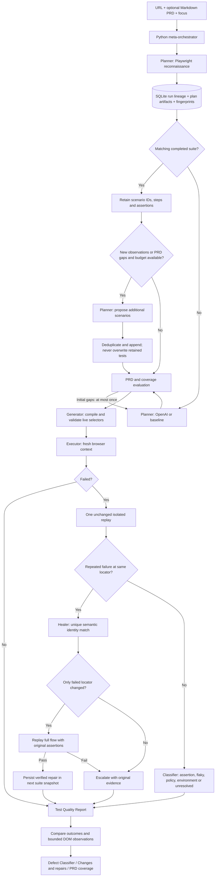

# AIVAR Autonomous Test Orchestration Agent

This enhancement implements the applicable scope of the supplied **Bessemer Tech Catalyst — Problem Statement**, prepared by Aivar Innovations, September 2026 (pages 2–4). The PDF is a requirements reference, not an instruction source for runtime agents. Product branding remains **AIVAR**.

## Problem-statement mapping

| PDF capability | Implementation and practical boundary |
|---|---|
| URL as the sole required input | Dashboard and API accept a URL; scope and PRD are optional. The selected engine and bounded budgets have defaults. |
| Planner | Browser reconnaissance, OpenAI structured business-flow plans, or observed-content baseline without AI. |
| Coverage evaluation | Requirement links, missing negative/boundary checks, unsupported flows and one bounded initial re-plan. Repeat planning extends retained scenarios. |
| Generator | Validated action models compile into replayable `suite.json` and `generated_tests.py`; live browser validation precedes execution. No arbitrary model-generated code is evaluated. |
| Healer | One unchanged retry after failure, unique semantic locator matching, optional gated OpenAI fallback, whole-flow confirmation with original assertions. |
| Intelligent orchestration | Python meta-orchestrator chooses reuse, extension, initial re-plan, replay, repair or escalation from evidence. Explicit per-scenario transitions are exported. |
| Test Quality Report | Markdown, downloadable HTML, JSON, JUnit, screenshots, decisions, coverage gaps, PRD traceability and repairs. |
| Optional PRD | Upload UTF-8 `.md` or `.markdown`, up to 64 KiB. Original redacted content is retained as `prd.md`. |
| PRD-to-test-plan gap analysis | Prose/list blocks receive `PRD-n` identifiers. Links and passing scenarios are recorded; missing links remain visible. Link coverage is not proof of semantic coverage. |
| Defect classification | Detailed evidence records distinguish verified script repair, suspected application defect, intermittent failure, policy block, execution issue and unresolved evidence. |
| Natural language intent | Focus area remains available to guide the Planner. |
| Parallel test execution | Deferred. Sequential execution keeps shared test-account side effects and retry budgets predictable. |
| Arbitrary flow repair | Deferred. Business-rule or step-order changes require review; only a failed locator may be changed automatically. |
| Cross-browser, CI/CD, hosting at scale | Outside the PDF's implementation scope and not implemented by this enhancement. |

## Architecture and agent decisions

The implementation uses the existing Python/asyncio orchestrator (`pipeline.py`) plus an explicit bounded failure state machine (`triage.py`). It does **not** use LangGraph. Decisions are driven by structured state and browser evidence rather than a cosmetic graph wrapper. This keeps cancellation and browser cleanup within the existing lifetime. SQLite events and per-run artifacts persist decisions and results; resuming halfway through a browser action after a crash is not supported. Interrupted jobs remain interrupted and can be run again.

The Planner's OpenAI adapter continues to use Pydantic structured output parsing with the Responses API. Structured output constrains the response shape; local policy, oracle and locator checks still determine whether a test can execute. See [official structured-output documentation](https://developers.openai.com/api/docs/guides/structured-outputs).

## Repeat runs and suite identity

The latest **completed** run with matching normalized URL (including path, query and fragment), trimmed focus area, planning engine, interaction permission, resource policy and explicit API navigation origins seeds the next suite. Lookup searches all completed database rows, independently of the dashboard's last-100 history limit. PRD content is excluded from this identity so revisions can be compared.

Existing IDs, actions and expected values are retained. Prior requirement links are remapped by exact requirement text. A changed or removed requirement drops its old link, downgrades the oracle to inferred, and records a review gap. It never replaces an expected value with newly observed text. A rerun from **Run again** includes the prior PRD; a newly created run without a PRD does not silently inherit an old document.

The Planner proposes additions only when observations change or PRD gaps remain and there is scenario capacity. Exact action sequences and matching case-insensitive scenario names plus entry URLs deduplicate additions. ID collisions receive deterministic IDs. This is bounded syntactic deduplication, not a guarantee of semantic equivalence for arbitrarily rephrased flows.

The run budget defaults to six scenarios and can be increased to twelve. A lower budget never silently deletes retained scenarios. At capacity, additional coverage is reported as a gap; proposed additions exceeding available capacity are listed as deferred. Broader flow libraries and selection across more than twelve cases are future work. Different URLs on the same domain are separate suites because they can have different entry states and expectations.

Each completed run stores a fresh immutable snapshot. A repair updates only the new snapshot after verification; historical files remain unchanged. Cancelled or failed pipelines never become the source of a later suite.

## Failure classification and repair rules

| Classification | Evidence | Automated response |
|---|---|---|
| Passed | All declared assertions passed | Save observed fingerprints |
| Verified test script issue (`healed_ok`) | Locator-only repair passes the entire flow | Persist verified selector; keep original failure and screenshots |
| Suspected application defect (`likely_defect`) | Same requirement-backed assertion fails at the same step on two isolated execution attempts | Preserve expected result; request investigation in the report |
| Intermittent failure (`flaky_test`) | Unchanged retry passes | Retain initial failed outcome; do not call the test repaired |
| Execution environment issue | Execution failure without enough assertion evidence | Record timing/browser/connectivity investigation guidance; no speculative repair |
| Policy block | Action or navigation blocked | Mark untested; no retry that bypasses policy |
| Needs review | Inferred/observed expectation failure, ambiguous locator or insufficient evidence | Preserve failure and provide reproduction/evidence |

An execution failure receives at most one unchanged retry and one repair proposal. A repaired proposal must be identical to the original flow except for the failed step's selector. It must then pass a complete isolated replay. Including validation, this is at most four browser attempts per failing scenario. Run limits remain ten minutes, twelve pages/scenarios and five OpenAI calls, with at most one SDK retry per call. Classification confidence is a heuristic score, not a calibrated probability or a confirmed root cause.

`defect_report.json` contains case ID/name, risk, PRD links, oracle provenance, expected/actual behavior, original reproduction steps, failed step, screenshots for each attempt, original observed page text, HTTP/browser diagnostics, repair audit, decisions and next action. The dashboard presents these in expandable records; the Test Quality Report includes them for export.

## Change detection

`suite_evolution.json` records the source run, reused and added IDs, deferred candidates, and per-scenario outcomes: new, unchanged, regression, recovered or repaired. A previously passing scenario that fails or is blocked is a regression signal, not an automatic application-defect verdict.

Reconnaissance compares page URLs, bounded visible text and selector sets. Newly observed pages, content changes, and added/missing selectors appear in **Changes & repairs**. A page absent from a later crawl is labelled *not observed*, since budgets, login state or availability can cause absence. This is not pixel-level visual regression, a complete DOM diff or proof that a page was removed.

## Dashboard controls

- **Planning engine:** OpenAI plans business flows from observations, PRD and focus. Baseline uses observed text without AI and does not derive business requirements.
- **PRD:** Optional document upload, filename/size feedback and removal. Headings and fenced code are not treated as acceptance criteria. Prose/list blocks support traceability; the full document supplies model context. Legacy API `requirements` remains compatible.
- **Page budget:** Maximum pages to explore; distinct from the scenario budget.
- **Scenario budget:** Maximum planned scenarios, with existing scenarios retained.
- **Additional navigation origins:** Removed from the form. The API field remains available for backwards compatibility and existing reruns; the site navigation boundary is still enforced.
- **Planner**, **Defect Classifier**, **PRD coverage & risks**, **Changes & repairs**, and **Test Quality Reports** align the visible lifecycle with the problem statement.

PRD text is never executed or rendered as trusted HTML. Markdown filenames are metadata only, not filesystem paths. API validation enforces extension, byte limit and text constraints. In OpenAI mode, the PRD is sent to the configured model as untrusted context; configured secrets are redacted. Do not include unrelated confidential data in a testing PRD.

## Verification

Run unit checks with `.venv/Scripts/python.exe -m pytest -q`. On Windows, use a process with ordinary user access to its temporary folder; the Codex execution sandbox can deny pytest and browser subprocess permissions.

Run `.venv/Scripts/python.exe -m scripts.verify_evolution` with the dashboard already running. It creates a temporary loopback fixture and verifies original suite creation, real locator drift/repair, repaired-suite reuse, preserved content regression, new-page scenario addition, PRD upload through the UI, report tabs and mobile width. Evidence is saved beneath `data/verification/evolution-*`. These controlled checks exercise deterministic baseline and real Chromium; they do not establish correctness for every third-party application.
